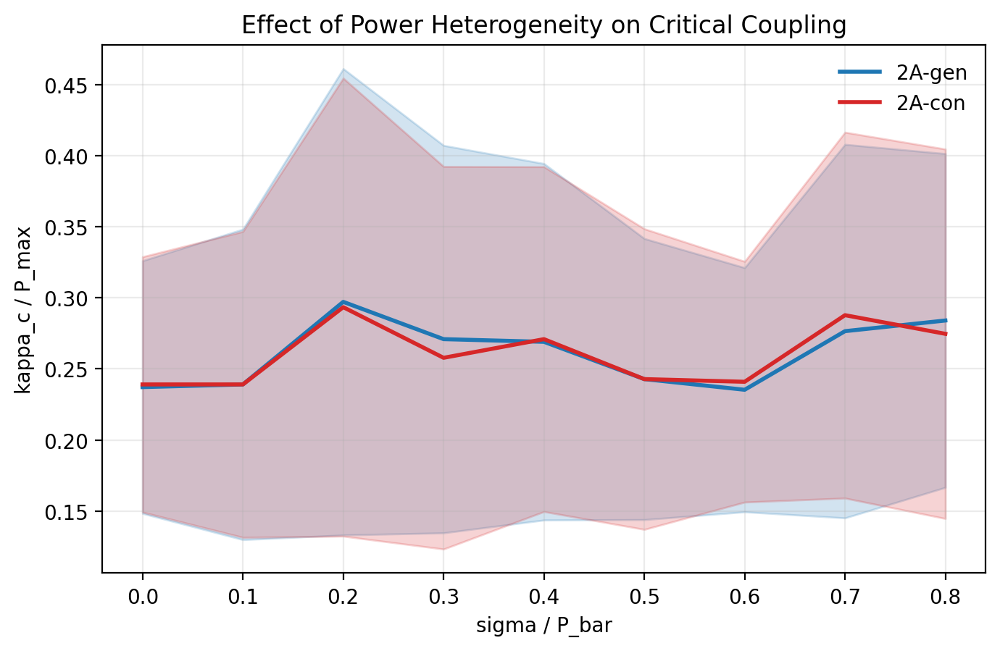

# Phase 2 研究报告：方向③ 非均匀功率分配对电网稳定性的影响

**项目**：Power Grid Dynamics Research  
**阶段**：Phase 2 - Direction 3（非均匀功率分配）  
**模型基础**：Smith et al., *Science Advances* 8, eabj6734 (2022)  
**报告日期**：2026-02-08  
**代码目录**：`direction3_nonuniform/`

---

## Executive Summary

本阶段在已复现 Fig.1 的代码基础上，实现并验证了两个扩展实验：

1. **实验 2A（异质程度扫描）**：研究功率分配标准差 `sigma/P_bar` 对临界耦合强度 `kappa_c` 的影响，并比较发电侧异质（2A-gen）与负荷侧异质（2A-con）。
2. **实验 2C（集中式 vs 分布式）**：研究单一大站承担比例 `r` 增加时 `kappa_c` 的变化。

本次开发验证采用 `n_ensemble=50`（按当前设备与迭代效率要求），全流程包括：实现、单元测试、集成测试、断点续跑、绘图与交付自检。结果显示：

- 2A 中异质性增大时 `kappa_c` 整体高于基线，但在 `n_ensemble=50` 下存在非单调波动；
- 2C 中 `r` 提高带来显著增稳阈值上升，`r=0.95` 相比 `r=0.04` 提升约 **97.4%**；
- 全部交付检查通过（CSV 行列完整、无 NaN、图片存在）。

---

## 1. 研究目标与问题定义

基于 swing equation：

$$
\frac{d^2\theta_k}{dt^2} + \gamma \frac{d\theta_k}{dt} = P_k - \kappa \sum_{l=1}^{n} A_{kl} \sin(\theta_k - \theta_l)
$$

本阶段聚焦以下问题：

1. 当发电或负荷功率从均匀分配变为异质分配时，`kappa_c` 如何变化？
2. 当发电由分布式向集中式过渡（大站占比 `r` 上升）时，稳定阈值如何变化？

---

## 2. 实验参数（关键标注）

### 2.1 全局固定物理参数

| 参数 | 数值 | 说明 |
|------|------|------|
| `n` | 50 | 节点总数 |
| `n_plus, n_minus` | 25, 25 | 发电/消费节点数 |
| `K` | 4 | Watts-Strogatz 平均度 |
| `q` | 0.1 | 重连概率 |
| `gamma` | 1.0 | 阻尼系数 |
| `P_max` | 1.0 | 总发电功率（总负荷绝对值） |

### 2.2 数值求解参数（本阶段运行配置）

| 参数 | 数值 | 说明 |
|------|------|------|
| `kappa_range` | `(0.001, 3.0)` | 二分搜索区间 |
| `bisection_steps` | 5 | 二分迭代步数 |
| `t_integrate` | 20 | ODE 积分时长 |
| `conv_tol` | `5e-3` | 收敛阈值 |
| `max_step` | 5.0 | `solve_ivp` 最大步长 |
| `n_ensemble` | 50 | 每个参数点网络实例数（本次） |
| RNG seed | 20260208 | 实验脚本随机数种子 |

> 说明：为快速自治迭代与可复现实验流程，本报告结果基于 `n_ensemble=50`。生产级统计可在高性能机器上用 `n_ensemble=200` 重跑同脚本。

### 2.3 扫描参数

- **实验 2A**：`sigma_ratio ∈ {0, 0.1, 0.2, 0.3, 0.4, 0.5, 0.6, 0.7, 0.8}`（9 点）
- **实验 2C**：`r ∈ {0.04, 0.1, 0.2, 0.3, 0.4, 0.5, 0.6, 0.7, 0.8, 0.9, 0.95}`（11 点）

---

## 3. 方法与实现

### 3.1 功率分配策略

1. **异质分配 `assign_power_heterogeneous()`**
- `side='gen'`：发电侧异质，负荷侧均匀。
- `side='con'`：负荷侧异质，发电侧均匀。
- 核心流程：高斯采样 -> 中心化 -> 截断（`delta=1e-4*P_bar`）-> 归一化。

2. **集中式分配 `assign_power_centralized()`**
- 1 个大站承担 `r * P_max`；其余 `n_plus-1` 个小站均分剩余功率。
- 消费侧维持均匀负荷。

### 3.2 与现有模型接口兼容性

本阶段严格适配 `paper_reproduction/model.py` 的现有接口：

- `generate_network(n, k, q, seed=None)`
- `compute_kappa_c(A_csr, P, config_params=None)`
- `compute_kappa_c_normalized(A_csr, P, P_max, config_params)`

并确保 `P[i]` 与网络节点 `i` 一一对应（邻接矩阵第 `i` 行/列）。

### 3.3 工程化特性

- 支持断点续跑：若 CSV 已有参数点，自动跳过。
- Checkpoint 写盘：每完成一个参数点即追加 CSV。
- 单实例容错：个别实例失败不终止整轮实验。

---

## 4. 测试与验证

### 4.1 单元测试（`test_power_allocation.py`）

- 结果：**9/9 通过**。
- 覆盖项：功率平衡、符号约定、总功率一致性、基线一致性、极端集中式、方差趋势、可复现性、向量长度。

### 4.2 集成测试（`test_integration.py`）

- 结果：**5/5 通过**。
- 覆盖项：`kappa_c` 可计算性、`sigma=0` 一致性、`r=1/25` 与均匀基线一致性、快速趋势检查、耗时估算。

### 4.3 交付自检（`self_check.py`）

- 结果：**全部通过**。
- 检查项：文件存在、2A 9 行、2C 11 行、列完整、无 NaN、`kappa_c > 0`。

---

## 5. 实验结果

### 5.1 实验 2A：异质程度扫描结果（n_ensemble=50）

| sigma_ratio | kappa_c_mean_gen | kappa_c_std_gen | kappa_c_mean_con | kappa_c_std_con |
|-------------|------------------|-----------------|------------------|-----------------|
| 0.0 | 0.237171 | 0.088890 | 0.239046 | 0.089814 |
| 0.1 | 0.239046 | 0.109230 | 0.239046 | 0.107609 |
| 0.2 | 0.297151 | 0.164059 | 0.293403 | 0.161120 |
| 0.3 | 0.270910 | 0.136315 | 0.257789 | 0.134590 |
| 0.4 | 0.269036 | 0.125401 | 0.270910 | 0.121314 |
| 0.5 | 0.242794 | 0.098899 | 0.242794 | 0.105765 |
| 0.6 | 0.235297 | 0.085895 | 0.240920 | 0.084679 |
| 0.7 | 0.276533 | 0.131420 | 0.287779 | 0.128719 |
| 0.8 | 0.284031 | 0.117414 | 0.274659 | 0.129982 |

*图 2A：功率异质性（发电侧/负荷侧）对临界耦合强度的影响。*

**观察**：

1. 相比 `sigma=0`，`sigma=0.8` 时两条曲线均值更高：
- gen：`0.237171 -> 0.284031`（+19.76%）
- con：`0.239046 -> 0.274659`（+14.90%）
2. 在 `n_ensemble=50` 下，曲线存在非单调波动（统计噪声较明显）。

### 5.2 实验 2C：集中式 vs 分布式（n_ensemble=50）

| r | kappa_c_mean | kappa_c_std |
|---|--------------|-------------|
| 0.04 | 0.257789 | 0.092890 |
| 0.10 | 0.235297 | 0.097395 |
| 0.20 | 0.254041 | 0.093719 |
| 0.30 | 0.319644 | 0.109695 |
| 0.40 | 0.360880 | 0.141027 |
| 0.50 | 0.411488 | 0.167272 |
| 0.60 | 0.432106 | 0.145491 |
| 0.70 | 0.448976 | 0.147636 |
| 0.80 | 0.497709 | 0.188372 |
| 0.90 | 0.493961 | 0.135889 |
| 0.95 | 0.508956 | 0.196443 |

*图 2C：发电集中化比例 `r` 与临界耦合强度的关系。*

**观察**：

1. 随 `r` 增大，`kappa_c` 整体显著抬升。
2. `r=0.95` 相比 `r=0.04`：`0.257789 -> 0.508956`，提升 **97.43%**。
3. 最低点出现在 `r=0.10`，最高点出现在 `r=0.95`。

---

## 6. 图像产出

- `direction3_nonuniform/results_n50/fig_2A.png`
- `direction3_nonuniform/results_n50/fig_2C.png`

图像由 `plot_results.py` 生成，使用 `matplotlib.use('Agg')`，可在无图形界面环境运行。

---

## 7. 结论与后续建议

### 7.1 阶段结论

1. 方向③的代码实现与原始复现框架成功对接，测试完整通过。
2. 2A 显示异质化会提高稳定阈值的总体趋势，但低集成规模下存在波动。
3. 2C 明确显示集中化程度提高会显著增加 `kappa_c`，与“分布式更利于同步”的预期一致。

### 7.2 后续建议（高性能机器）

1. 将 `n_ensemble` 提升到 `200` 重跑 `results/results_2A.csv` 和 `results/results_2C.csv`。
2. 保持相同脚本与参数点，仅放大集成规模，以降低统计波动并提升趋势置信度。
3. 可额外输出置信区间（如 bootstrap CI）用于论文级展示。

---

## 附：主要产出文件

- 代码实现：`direction3_nonuniform/*.py`
- 开发规模结果（本报告）：`direction3_nonuniform/results_n50/`
- 报告文件：`Phase2_Research_Report.md`
