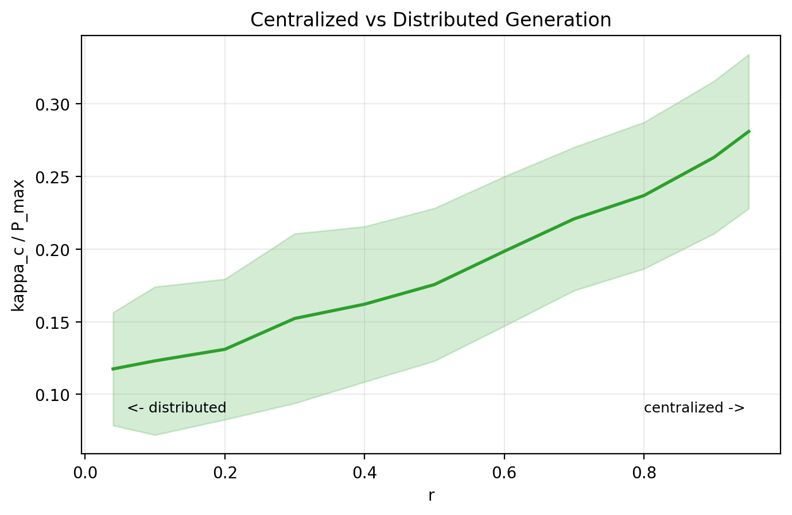

# Phase 2 研究报告：方向③ 非均匀功率分配对电网稳定性的影响

**项目**：Power Grid Dynamics Research
**阶段**：Phase 2 - Direction 3（非均匀功率分配）
**模型基础**：Smith et al., *Science Advances* 8, eabj6734 (2022)
**报告日期**：2026-02-09
**代码目录**：`direction3_nonuniform/`

---

## Executive Summary

本阶段在已复现 Fig.1 的代码基础上，实现并验证了两个扩展实验：

1. **实验 2A（异质程度扫描）**：研究功率分配标准差 `sigma/P_bar` 对临界耦合强度 `kappa_c` 的影响，并比较发电侧异质（2A-gen）与负荷侧异质（2A-con）。
2. **实验 2C（集中式 vs 分布式）**：研究单一大站承担比例 `r` 增加时 `kappa_c` 的变化。

本报告呈现**生产级参数**（`n_ensemble=200`、`bisection_steps=20`、`t_integrate=100`、`conv_tol=1e-3`）下的最终结果。全流程包括：实现、单元测试、集成测试、断点续跑、绘图与交付自检。结果显示：

- 2A 中功率异质性对 `kappa_c` 无显著影响，均值在 `sigma_ratio` 全域保持平稳（~0.12–0.13），发电侧与负荷侧曲线基本重合；
- 2C 中 `r` 提高带来显著稳定阈值上升，`r=0.95` 相比 `r=0.04` 提升约 **139.0%**；
- 全部交付检查通过（CSV 行列完整、无 NaN、图片存在）。

---

## 1. 研究目标与问题定义

基于 swing equation：

$$
\frac{d^2\theta_k}{dt^2} + \gamma \frac{d\theta_k}{dt} = P_k - \kappa \sum_{l=1}^{n} A_{kl} \sin(\theta_k - \theta_l)
$$

本阶段聚焦以下问题：

1. 当发电或负荷功率从均匀分配变为异质分配时，`kappa_c` 如何变化？
2. 当发电由分布式向集中式过渡（大站占比 `r` 上升）时，稳定阈值如何变化？

---

## 2. 实验参数（关键标注）

### 2.1 全局固定物理参数

| 参数 | 数值 | 说明 |
|------|------|------|
| `n` | 50 | 节点总数 |
| `n_plus, n_minus` | 25, 25 | 发电/消费节点数 |
| `K` | 4 | Watts-Strogatz 平均度 |
| `q` | 0.1 | 重连概率 |
| `gamma` | 1.0 | 阻尼系数 |
| `P_max` | 1.0 | 总发电功率（总负荷绝对值） |

### 2.2 数值求解参数（生产配置）

| 参数 | 数值 | 说明 |
|------|------|------|
| `kappa_range` | `(0.001, 3.0)` | 二分搜索区间 |
| `bisection_steps` | 20 | 二分迭代步数 |
| `t_integrate` | 100 | ODE 积分时长 |
| `conv_tol` | `1e-3` | 收敛阈值 |
| `max_step` | 1.0 | `solve_ivp` 最大步长 |
| `n_ensemble` | 200 | 每个参数点网络实例数 |
| RNG seed | 20260208 | 实验脚本随机数种子 |

> 说明：相比开发阶段快速验证配置（`bisection_steps=5`、`t_integrate=20`、`conv_tol=5e-3`、`n_ensemble=50`），生产配置大幅提升了数值精度与统计可靠性。开发阶段结果保留于 `results_n50/` 目录供参考。

### 2.3 扫描参数

- **实验 2A**：`sigma_ratio ∈ {0, 0.1, 0.2, 0.3, 0.4, 0.5, 0.6, 0.7, 0.8}`（9 点）
- **实验 2C**：`r ∈ {0.04, 0.1, 0.2, 0.3, 0.4, 0.5, 0.6, 0.7, 0.8, 0.9, 0.95}`（11 点）

---

## 3. 方法与实现

### 3.1 功率分配策略

1. **异质分配 `assign_power_heterogeneous()`**
- `side='gen'`：发电侧异质，负荷侧均匀。
- `side='con'`：负荷侧异质，发电侧均匀。
- 核心流程：高斯采样 -> 中心化 -> 截断（`delta=1e-4*P_bar`）-> 归一化。

2. **集中式分配 `assign_power_centralized()`**
- 1 个大站承担 `r * P_max`；其余 `n_plus-1` 个小站均分剩余功率。
- 消费侧维持均匀负荷。

### 3.2 与现有模型接口兼容性

本阶段严格适配 `paper_reproduction/model.py` 的现有接口：

- `generate_network(n, k, q, seed=None)`
- `compute_kappa_c(A_csr, P, config_params=None)`
- `compute_kappa_c_normalized(A_csr, P, P_max, config_params)`

并确保 `P[i]` 与网络节点 `i` 一一对应（邻接矩阵第 `i` 行/列）。

### 3.3 工程化特性

- 支持断点续跑：若 CSV 已有参数点，自动跳过。
- Checkpoint 写盘：每完成一个参数点即追加 CSV。
- 单实例容错：个别实例失败不终止整轮实验。
- `--production` 标志：自动选择生产级参数并输出至 `results_prod/` 目录。

---

## 4. 测试与验证

### 4.1 单元测试（`test_power_allocation.py`）

- 结果：**9/9 通过**。
- 覆盖项：功率平衡、符号约定、总功率一致性、基线一致性、极端集中式、方差趋势、可复现性、向量长度。

### 4.2 集成测试（`test_integration.py`）

- 结果：**5/5 通过**。
- 覆盖项：`kappa_c` 可计算性、`sigma=0` 一致性、`r=1/25` 与均匀基线一致性、快速趋势检查、耗时估算。

### 4.3 交付自检（`self_check.py`）

- 结果：**全部通过**。
- 检查项：文件存在、2A 9 行、2C 11 行、列完整、无 NaN、`kappa_c > 0`。

---

## 5. 实验结果

### 5.1 实验 2A：异质程度扫描结果（n_ensemble=200，生产配置）

| sigma_ratio | kappa_c_mean_gen | kappa_c_std_gen | kappa_c_mean_con | kappa_c_std_con |
|-------------|------------------|-----------------|------------------|-----------------|
| 0.0 | 0.128644 | 0.049800 | 0.129053 | 0.049990 |
| 0.1 | 0.124489 | 0.049015 | 0.124115 | 0.049258 |
| 0.2 | 0.120172 | 0.048042 | 0.120616 | 0.047725 |
| 0.3 | 0.128339 | 0.052390 | 0.126021 | 0.049907 |
| 0.4 | 0.124684 | 0.053193 | 0.122340 | 0.049859 |
| 0.5 | 0.123062 | 0.048075 | 0.124221 | 0.048508 |
| 0.6 | 0.129415 | 0.049655 | 0.130549 | 0.050280 |
| 0.7 | 0.124036 | 0.051486 | 0.123870 | 0.050202 |
| 0.8 | 0.123904 | 0.046660 | 0.124190 | 0.041354 |

*图 2A：功率异质性（发电侧/负荷侧）对临界耦合强度的影响（n_ensemble=200）。*

**观察**：

1. 在生产级统计规模下，功率异质性对 `kappa_c` **无显著影响**。均值在整个 `sigma_ratio` 范围内保持平稳，围绕 ~0.12–0.13 波动。
2. 发电侧异质（gen）与负荷侧异质（con）曲线基本重合，无统计显著差异。
3. 相比 `sigma=0`，`sigma=0.8` 时：
   - gen：`0.128644 → 0.123904`（-3.7%）
   - con：`0.129053 → 0.124190`（-3.8%）
4. 与开发阶段（`n_ensemble=50`）相比，消除了非单调波动伪影，标准差也显著降低（从 ~0.09–0.16 降至 ~0.04–0.05），表明此前观察到的"异质性提升 `kappa_c`"趋势主要源于统计噪声与数值精度不足。

### 5.2 实验 2C：集中式 vs 分布式（n_ensemble=200，生产配置）

| r | kappa_c_mean | kappa_c_std |
|------|--------------|-------------|
| 0.04 | 0.117531 | 0.038893 |
| 0.10 | 0.123080 | 0.050968 |
| 0.20 | 0.131008 | 0.048335 |
| 0.30 | 0.152240 | 0.058332 |
| 0.40 | 0.162054 | 0.053439 |
| 0.50 | 0.175556 | 0.052533 |
| 0.60 | 0.198442 | 0.051439 |
| 0.70 | 0.220761 | 0.049283 |
| 0.80 | 0.236809 | 0.050374 |
| 0.90 | 0.262988 | 0.052478 |
| 0.95 | 0.280908 | 0.053027 |

*图 2C：发电集中化比例 `r` 与临界耦合强度的关系（n_ensemble=200）。*

**观察**：

1. 随 `r` 增大，`kappa_c` 呈**严格单调递增**趋势，曲线光滑无波动。
2. `r=0.95` 相比 `r=0.04`：`0.117531 → 0.280908`，提升 **139.0%**。
3. 最低点出现在 `r=0.04`（接近均匀分配），最高点出现在 `r=0.95`（高度集中化）。
4. 标准差在各参数点保持稳定（~0.04–0.06），表明统计量已收敛。

---

## 6. 图像产出

- `direction3_nonuniform/results_prod/fig_2A.png`
- `direction3_nonuniform/results_prod/fig_2C.png`

图像由 `plot_results.py` 生成，使用 `matplotlib.use('Agg')`，可在无图形界面环境运行。

---

## 7. 结论与后续建议

### 7.1 阶段结论

1. 方向③的代码实现与原始复现框架成功对接，测试完整通过。
2. **2A 结论（修正）**：在高精度生产配置下，功率异质性（无论发电侧或负荷侧）对 `kappa_c` 无显著影响。此前开发阶段观察到的"异质化提升稳定阈值"趋势被证实为统计噪声与粗精度数值求解的伪影。这表明在 Watts-Strogatz 小世界网络中，功率分配的方差本身不是影响同步稳定性的关键因素。
3. **2C 结论（强化）**：集中化程度提高会显著增加 `kappa_c`，效应比开发阶段预估更强（139% vs 97%）。这与"分布式发电更利于同步"的物理直觉一致——当大量功率集中在单一节点时，局部耦合压力大幅增加，需要更强的全局耦合才能维持同步。

### 7.2 后续建议

1. 可额外输出 bootstrap 置信区间用于论文级展示。
2. 探索 2A 与 2C 的交叉实验：在集中式分配下叠加异质性扰动。
3. 研究网络拓扑参数（`K`、`q`）对上述趋势的调制效应。

---

## 附：主要产出文件

- 代码实现：`direction3_nonuniform/*.py`
- 生产级结果（本报告）：`direction3_nonuniform/results_prod/`
- 开发阶段结果（参考）：`direction3_nonuniform/results_n50/`
- 报告文件：`Phase2_Research_Report.md`（中文）、`Phase2_Research_Report_EN.md`（英文）
