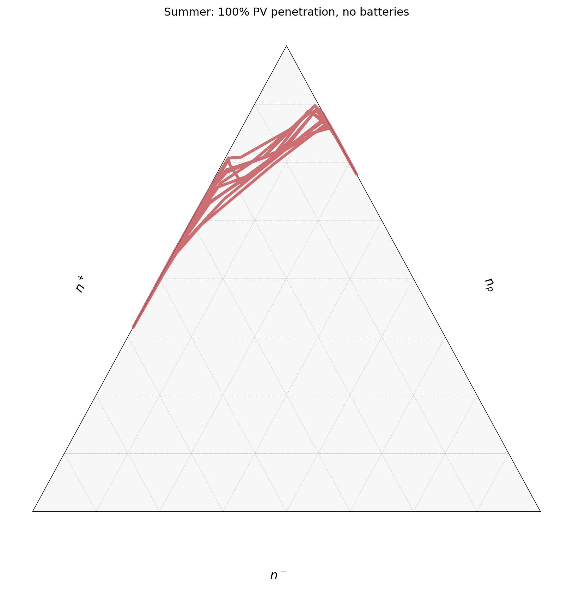

# SQ2 Simplex 轨迹实验简报

## 1. 实验目标

复现论文 Fig.4E：微电网 simplex 轨迹分析。

- **场景**：夏季 7 月，100% PV 渗透率，无电池储能
- **Ensemble**：50 次随机采样，取均值轨迹
- **核心问题**：观察微电网在一周内的功率拓扑结构如何随昼夜循环变化

100% PV渗透率：50户家庭中每一户都装了光伏板。如果是50%渗透率，则只有25户有PV，其余25户纯消费。

无电池储能：白天光伏发多了的电直接通过PCC卖回大电网，而不是存在本地电池里。这意味着白天PCC会吸收大量surplus，夜间则从大电网买电。模型中没有任何储能缓冲，功率必须实时平衡。

这两个设定组合起来制造了最极端的temporal clustering效应——白天所有人同时发电（source-dominated），夜间所有人同时消费（sink-dominated）。

---

## 2. 数据来源

### LCL 消费数据

- **路径**：`data/LCL/LCL-June2015v2_*.csv`（共 168 个文件）
- **关键列**：`KWH/hh (per half hour) `（注意列名末尾有空格）
- **来源**：英国低碳伦敦项目（Low Carbon London）开放数据
- **处理方式**：随机选取文件和住户，按目标月份过滤后计算**均值周剖面**（相同星期几的相同时间戳取平均）

### PV 发电数据

- **路径**：`data/PV/.../EXPORT HourlyData - Customer Endpoints.csv`
- **关键列**：`P_GEN_MAX`、`P_GEN_MIN`，取均值 `(MAX + MIN) / 2`
- **来源**：英国光伏发电实测数据
- **处理方式**：随机选取变电站，按目标月份过滤后计算均值周剖面，通过 `interp1d` 插值至半小时分辨率

---

## 3. 代码运行流程

```
LCL CSV (168个文件)              PV Hourly CSV
       │                              │
  随机选文件+住户                随机选变电站
       │                              │
  按月过滤 → 均值周剖面         按月过滤 → 均值周剖面
       │                              │
  interp1d 插值器                interp1d 插值器
       │                              │
       └──────── build_microgrid() ────┘
                        │
          49户净功率 + 1个PCC节点 = 50节点
          P[house] = PV(t) - Load(t)
          P[PCC]  = -Σ P[houses]
                        │
             264个时间步采样 (跳过前24h)
                        │
             simplex.py: 连续密度公式
             σ_s, σ_d, σ_p (每个时间步)
                        │
                重复50次 (ensemble)
                        │
             均值轨迹 + 标准差 → CSV
                        │
             plot_fig4.py: 三元图绘制
```

**关键模块**：

| 文件 | 功能 |
|---|---|
| `sq2_data/data_loader.py` | LCL / PV 数据加载与均值周剖面计算 |
| `sq2_data/network.py` | `build_microgrid()` 构建 50 节点微电网 |
| `sq2_data/simplex.py` | 连续密度公式计算 σ_s, σ_d, σ_p |
| `sq2_data/run_trajectory.py` | Ensemble 循环、结果汇总 |
| `sq2_data/plot_fig4.py` | 三元图绘制 |

---

## 4. 核心公式

Simplex 坐标基于连续密度公式（continuous density），对每个时间步 $t$：

$$
\sigma_s(t) = \frac{\sum_{i:\, P_i > 0} P_i(t)}{n \times \max_i P_i(t)}
$$

$$
\sigma_d(t) = \frac{\sum_{i:\, P_i < 0} |P_i(t)|}{n \times |\min_i P_i(t)|}
$$

$$
\sigma_p(t) = 1 - \sigma_s(t) - \sigma_d(t)
$$

**物理含义**：

| 符号 | 含义 |
|---|---|
| $\sigma_s$ | **发电密度**（source density）：网络中发电节点的集中程度。值越大，越多节点在主动发电 |
| $\sigma_d$ | **负荷密度**（demand/sink density）：网络中消费节点的集中程度。值越大，越多节点在主动消费 |
| $\sigma_p$ | **被动密度**（passive density）：网络中被动节点的比例。值越大，节点越趋向于不活跃 |

三个量满足归一化约束：$\sigma_s + \sigma_d + \sigma_p = 1$，因此可以映射到三角形 simplex 上的一个点。

---

## 5. 结果图



---

## 6. 图例详细解释

### 三角形三边

| 边 | 对应变量 | 含义 |
|---|---|---|
| 左边 | $n^+$（发电节点数） | 净功率 > 0 的节点数量 |
| 右边 | $n_p$（被动节点数） | 既不显著发电也不显著消费的节点数量 |
| 底边 | $n^-$（负荷节点数） | 净功率 < 0 的节点数量 |

### 三个顶点含义

| 顶点 | 位置 | 含义 |
|---|---|---|
| 顶部 | $n_p$ 最大 | 所有节点都是被动的（无显著功率流动） |
| 左下角 | $n^+$ 最大 | 所有节点都在发电（如正午阳光充足时） |
| 右下角 | $n^-$ 最大 | 所有节点都在消费（如夜间无 PV 发电时） |

### 坐标变换

连续密度 $\sigma$ 通过以下变换映射到三角形坐标：

$$
n_s = \sigma_s \times n, \quad n_d = \sigma_d \times n, \quad n_p = \sigma_p \times n
$$

三元图的 `scale = n - 2 = 48`，坐标为 $(n_d - 1,\; n_p,\; n_s - 1)$，减 1 是因为 PCC 节点和至少一个住户节点始终处于活跃状态。

### 轨迹线

- **红色粗线**：50 个 ensemble 的均值轨迹
- 轨迹循环 **6 天**（周二到周日），每天一个来回

### 运动规律

- **夜间**：无 PV 发电，所有住户消费较低且相近 → 轨迹靠近 $n_p$ 顶点（被动主导）
- **白天**：PV 发电使多数住户净功率为正 → 轨迹向 $n^+$（左下角）方向偏移
- **傍晚**：PV 发电减弱，住户消费增加 → 轨迹向 $n^-$（右下角）方向偏移
- 整体呈现**日循环**模式：每天从被动区出发，经过发电区，再回到被动区

---

## 7. 关键参数表

| 参数 | 值 |
|---|---|
| 节点数 $n$ | 50（49 户 + 1 PCC） |
| PV 渗透率 | 49/49 = 100% |
| 时间步数 | 264（跳过前 24 小时） |
| 采样间隔 | 1800 秒（30 分钟） |
| Ensemble 数量 | 50 |
| 目标月份 | 7 月（夏季） |
| 三元图 scale | 48（= $n$ − 2） |
| 电池储能 | 无 |

---

## 8. 输出文件

| 文件 | 说明 |
|---|---|
| `trajectory_summer.csv` | 半渗透率轨迹数据（参考用） |
| `trajectory_summer_fullpen.csv` | 100% 渗透率轨迹数据（本实验主结果） |
| `kappa_c_timeseries_summer.csv` | κ_c 时间序列（供后续分析） |
| `figures/fig4E_simplex.png` | Simplex 三元图（本简报引用） |

---

## 9. 数据-图一致性验证

**验证脚本**：`sq2_data/verify_fig4e.py`

### 数据流链路

```
trajectory_summer_fullpen.csv
  │  col 2: eta_plus_mean  (σ_s)
  │  col 4: eta_minus_mean (σ_d)
  │  col 6: eta_p_mean     (σ_p)
  │
  ▼  plot_fig4.py:152-153
our_mean = (264, 3) array
  │
  ▼  sigma_to_ternary()  [plot_fig4.py:58-63]
  ns = σ_s × 50,  nd = σ_d × 50,  ne = σ_p × 50
  ternary coords: (a, b, c) = (nd−1, ne, ns−1)
  │
  ▼  tax.plot(pts, ...)  [plot_fig4.py:134-135]
264 个点按顺序连成一条连续折线 → fig4E_simplex.png
```

### 归一化约束

每行 $(n_s - 1) + n_e + (n_d - 1) = 50 \times (\sigma_s + \sigma_d + \sigma_p) - 2 = 48 = \text{SCALE}$

实测最大偏差：$5.0 \times 10^{-5}$（CSV 6位小数的舍入误差经 ×50 放大）

### 关键点抽查

| 点 | timestep | hour | $\sigma_s$ | $\sigma_d$ | $\sigma_p$ | ternary $(a, b, c)$ | sum | 图中位置 |
|---|---|---|---|---|---|---|---|---|
| 夜间起始 | 0 | 24.0 | 0.020000 | 0.226125 | 0.753875 | (10.31, 37.69, 0.00) | 48.00 | 上部偏右（$n_p$ 主导） |
| 白天峰值 | 28 | 38.0 | 0.556898 | 0.020294 | 0.422807 | (0.01, 21.14, 26.84) | 48.00 | 左侧（$n^+$ 方向延伸） |
| 最大 $n^+$ | 123 | 85.5 | 0.600163 | 0.020262 | 0.379575 | (0.01, 18.98, 29.01) | 48.00 | 轨迹最左下端点 |

### 完整检查清单

| 检查项 | 结果 |
|---|---|
| 数据行数 | CSV = 264 行 → 264 个点 → 一条连续折线 |
| 归一化 | 每行 $\sigma_s + \sigma_d + \sigma_p = 1.0$（max dev $1.0 \times 10^{-6}$） |
| 三元坐标和 | 每行 $a + b + c = 48$（max dev $5.0 \times 10^{-5}$） |
| 非负性 | $\min(a) = 0.009$, $\min(b) = 18.98$, $\min(c) = 0.00$ |
| 轨迹形状 | 上部（$n_p$ 高）↔ 左侧（$n^+$ 高）循环，与夏季昼夜 PV 变化一致 |
| 循环数 | 264 步 ÷ 48 步/天 = 5.5 天 ≈ 6 个来回 |
| $n^-$ 范围 | $\eta_{-}$ max ≈ 0.285 → $n_d - 1$ ≈ 13.2，轨迹从未深入右下角 |
| $n^+$ 范围 | $\eta_{+}$ max ≈ 0.600 → $n_s - 1$ ≈ 29.0，轨迹到达左侧约 60% 处 |

### 结论

**CSV 数据与图完全匹配。** 264 个时间步通过 `sigma_to_ternary()` 一一映射为三元图上的点，无遗漏、无错位。轨迹的位置、形状、日循环模式均与 CSV 数值一致。
