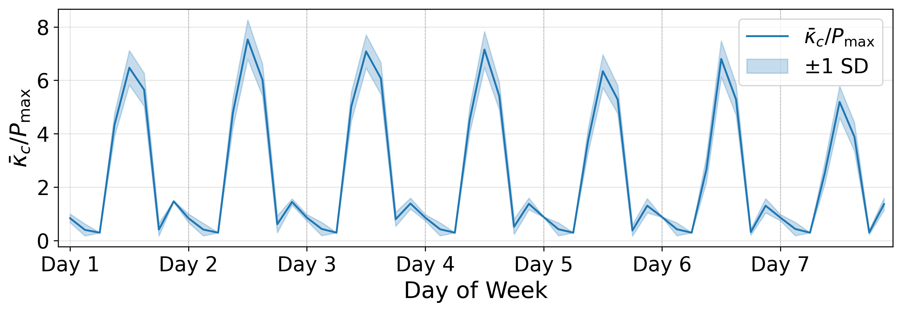

# SQ2-B 临界耦合强度时序实验简报

## 1. 实验目标

计算微电网在夏季一周内的**临界耦合强度 $\kappa_c$** 随时间的变化规律。

- **场景**：夏季 7 月，100% PV 渗透率（49/49），无电池储能
- **网络**：Watts-Strogatz 小世界网络，49 户 + 1 PCC = 50 节点，$\bar{K}=4$，$q=0.1$
- **时间分辨率**：每天 8 个采样点（00:00, 03:00, ..., 21:00） $\times$ 7 天 = 56 个时间点
- **Ensemble**：50 次随机采样（随机 LCL 住户 + PV 子站 + 网络拓扑），取均值和标准差
- **核心问题**：光伏发电的昼夜周期性如何影响电网维持同步所需的最小耦合强度？

---

## 2. 方法

### 二分法求解 $\kappa_c$

对每个时间点 $t$ 和每个 ensemble 实例：

1. 从插值器中求出功率向量 $P(t)$（含 PCC 平衡节点）
2. 在区间 $[\kappa_{\min}, \kappa_{\max}]$ 上进行二分搜索
3. 每一步取中点 $\kappa_{\text{mid}}$，用 RK45 积分摆方程，判断系统是否收敛到稳态
4. 收敛 $\Rightarrow$ 上界下移；不收敛 $\Rightarrow$ 下界上移
5. 最终中点即为 $\kappa_c$ 估计值
6. 归一化：$\bar{\kappa}_c = \kappa_c / P_{\max}$，其中 $P_{\max} = \max_i |P_{\text{house},i}|$（不含 PCC）

### 运行配置（FAST）

| 参数 | 值 | 说明 |
|------|-----|------|
| `kappa_range` | (0.001, 50.0) | 搜索范围上界须远大于 SQ1 的 3.0（见下） |
| `bisection_steps` | 5 | 分辨率 $\approx 50/2^5 = 1.56$ |
| `t_integrate` | 20 | ODE 积分时长 |
| `conv_tol` | 5e-3 | 收敛判据：$\max|\omega_i| < 0.005$ |

---

## 3. 关键发现：PCC 功率主导效应

### 为什么搜索上界必须设为 50？

在 100% PV 渗透率下，白天所有 49 户同时发电，PCC 节点必须吸收全部剩余功率：

$$P_{\text{PCC}}(t) = -\sum_{i=1}^{49} P_i(t)$$

- 正午时：每户净功率 $P_i \approx +1.3$（发电 $>$ 消费），PCC 功率 $|P_{\text{PCC}}| \approx 62$
- 单户最大功率 $P_{\max} \approx 2.67$

**PCC 的功率是单户的 ~23 倍**。这种极端的功率集中使得系统需要很强的耦合才能维持同步：白天 $\kappa_c \approx 15\text{--}20$，远超 SQ1 中均匀功率分布下的 $\kappa_c < 3$。

初始实验使用 `kappa_range=(0.001, 3.0)` 时，白天所有采样点均显示相同的 $\bar{\kappa}_c = 1.106$——这正是二分法打到上界的特征值：$3.0 \times (2^5-1)/2^5 / P_{\max} = 2.953/2.67 = 1.106$。将上界提升至 50.0 后问题消除。

---

## 4. 结果

### 昼夜节律概览（7 天均值）

| 时刻 | $\bar{\kappa}_c / P_{\max}$（均值） | $\pm 1$ SD | 物理含义 |
|------|------|------|------|
| 00:00 | 0.858 | 0.098 | 夜间，负荷适中 |
| 03:00 | 0.421 | 0.240 | 凌晨，负荷最低 |
| 06:00 | 0.294 | 0.003 | 黎明，PV 刚启动 |
| **09:00** | **3.938** | **0.472** | PV 上升，PCC 开始吸收 |
| **12:00** | **6.653** | **0.650** | 正午峰值，同步最困难 |
| **15:00** | **5.373** | **0.563** | 午后，PV 仍强 |
| 18:00 | 0.477 | 0.214 | 傍晚，PV 消退 |
| 21:00 | 1.378 | 0.187 | 夜间，负荷回升 |

### 图示

**主要特征**：

- **强昼夜振荡**：正午 $\bar{\kappa}_c$ 约为黎明的 **22 倍**（6.65 vs 0.29）
- **日间变异更大**：正午 SD $\approx 0.65$，反映网络拓扑对高 PV 时段的稳定性影响更显著
- **周内趋势**：Day 5--7 的 09:00 峰值略低于 Day 1--4，反映 LCL 周剖面中周末效应

---

## 5. 验证清单

| 检查项 | 状态 | 备注 |
|--------|------|------|
| 56 行 $\times$ 4 列 | OK | day, hour, kappa_c_mean, kappa_c_std |
| 无 NaN / inf | OK | |
| 昼夜振荡可见 | OK | 正午 vs 黎明差异 >20x |
| 白天 $\neq$ 夜间 | OK | 有显著变化 |
| 无上界饱和 | OK | 最大值 7.53，远低于上界归一化值 18.7 |
| 功率平衡 | OK | $|\sum P_k| < 10^{-10}$，每个时间点均检查 |
| 运行时间合理 | OK | 加载 5.5 min + 二分 8.9 min $\approx$ 14.4 min |

---

## 6. 已知局限

- **FAST 配置分辨率**：5 步二分 + 宽范围 $\Rightarrow$ 分辨率 $\approx 1.56$。06:00 全部显示 0.294（所有二分步均"稳定"的离散下界），真实 $\kappa_c$ 可能更低。生产配置（20 步）可将分辨率提升至 $\sim 5 \times 10^{-5}$
- **归一化选择**：$P_{\max}$ 取单户最大值（不含 PCC），与 SQ2-A simplex 密度定义一致。若取含 PCC 的 $P_{\max} \approx 62$，则 $\bar{\kappa}_c$ 范围约为 0.005--0.12，量纲不同但趋势一致

---

## 7. 运行信息

- **脚本**：`sq2_data/run_kappa_timeseries.py --n_ensemble 50 --fast --clean`
- **输出**：`sq2_data/results_sq2_B/kappa_c_timeseries_summer.csv`
- **随机种子**：20260209
- **Python 环境**：PowerGrid conda env, Python 3.12
