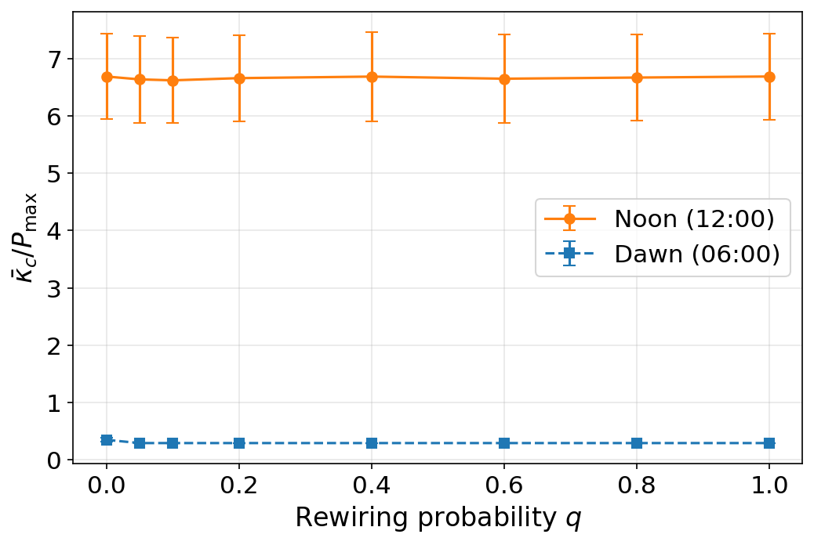
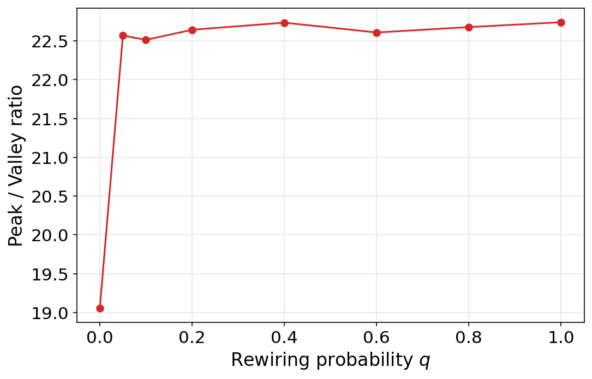
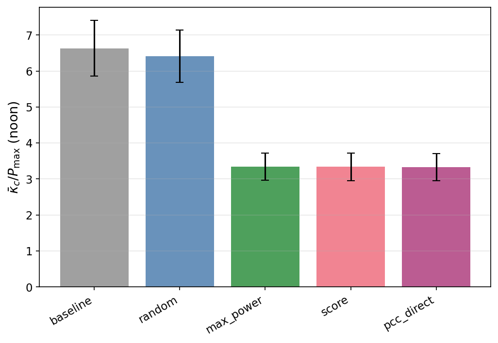
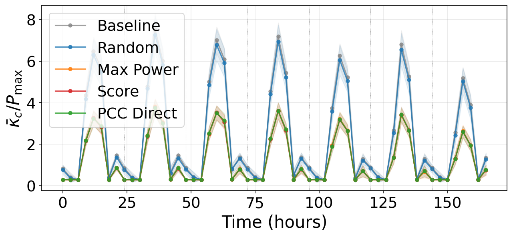
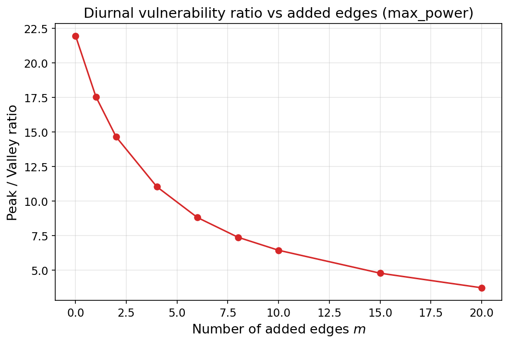
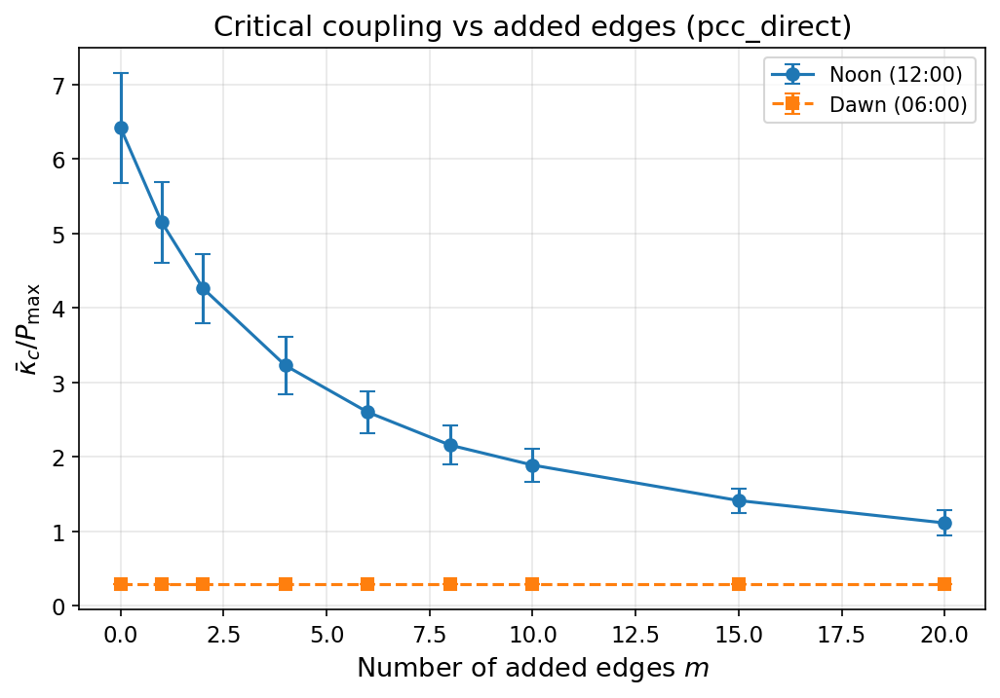
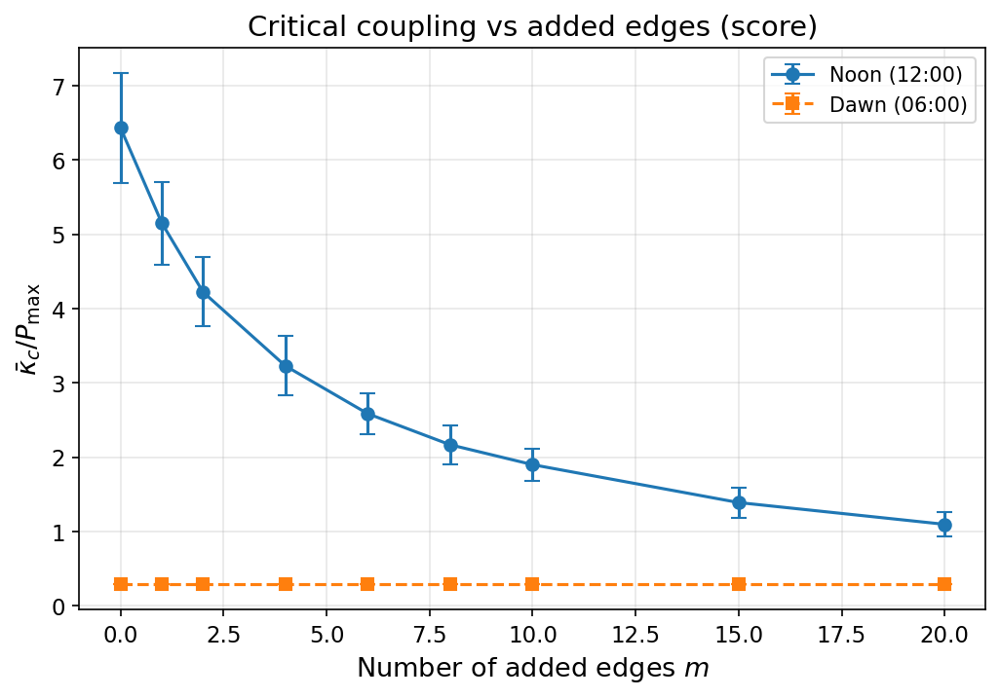
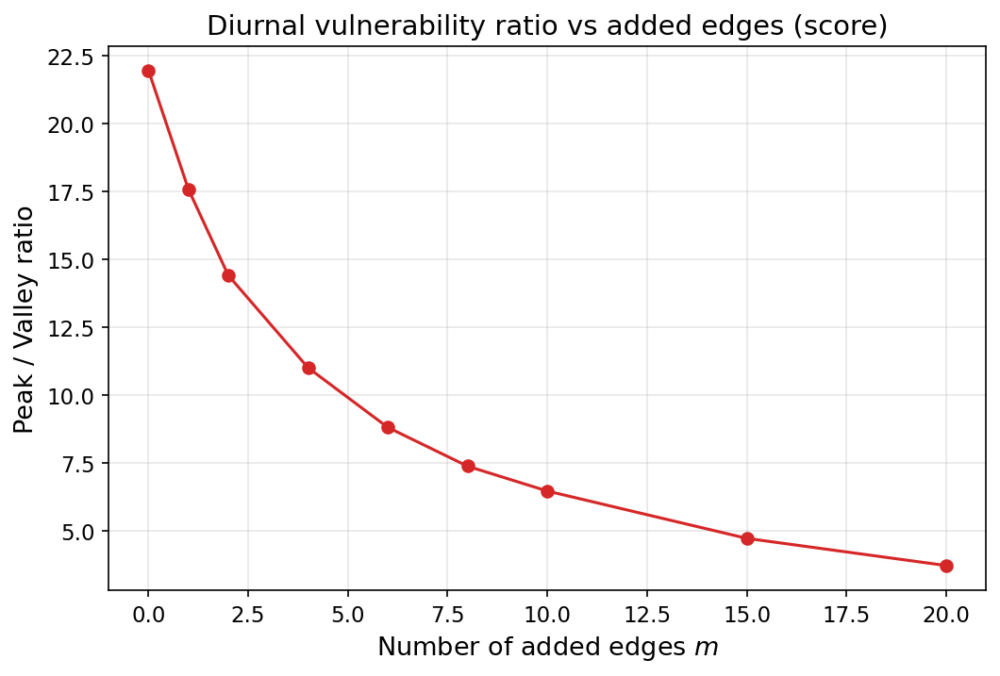

# SQ4 实验结果汇报 — 拓扑优化与边添加策略

**分支**: `exp/SQ4`
**日期**: 2025-02-11
**配置**: FAST（5 bisection steps, range 0.001–50.0）
**网络**: WS(n=50, K̄=4) + 1 PCC = 51 nodes
**时间采样**: 56 points = 8 hours/day × 7 days

---

## Exp 4A — Rewiring Probability Sweep (q-sweep)

**实验 ID**: SQ4-4A-n50-FAST
**运行参数**: q ∈ {0.0, 0.05, 0.1, 0.2, 0.4, 0.6, 0.8, 1.0}, n_ensemble=50, FAST config

### 结果数据

| q | κ_c(noon) mean | κ_c(noon) std | κ_c(dawn) mean | Peak/Valley Ratio |
|------|----------------|---------------|----------------|-------------------|
| 0.0  | 6.686          | 0.747         | 0.351          | 19.06             |
| 0.05 | 6.636          | 0.759         | 0.294          | 22.57             |
| 0.1  | 6.619          | 0.748         | 0.294          | 22.51             |
| 0.2  | 6.658          | 0.748         | 0.294          | 22.64             |
| 0.4  | 6.685          | 0.778         | 0.294          | 22.74             |
| 0.6  | 6.648          | 0.773         | 0.294          | 22.61             |
| 0.8  | 6.668          | 0.753         | 0.294          | 22.68             |
| 1.0  | 6.686          | 0.753         | 0.294          | 22.74             |

### 关键发现

> **重要负结果**：Rewiring probability q 对 κ_c(noon) 几乎没有影响 — 所有值集中在 6.6–6.7 范围内。拓扑随机化（small-world rewiring）本身**不能**提高电网韧性。

**异常记录**: q ≥ 0.05 时，κ_c(dawn) 固定在 0.294，标准差为 ~6e-17（本质为零）。这表明黎明时段功率动态极低，系统行为接近确定性。

### 图表

### 输出文件

- CSV: `sq4_data/results/exp4A/sq4a_q_sweep.csv`
- 图: `sq4_data/figures/fig_4a1_kc_vs_q.png`, `fig_4a2_ratio_vs_q.png`

---

## Exp 4B — Edge Addition Strategies

### Step 1: 策略对比 (m=4, n_ensemble=50)

**实验 ID**: SQ4-4B-S1-n50-FAST
**运行参数**: 5 种策略, m=4 added edges, q=0.1 baseline network

**策略说明**:

| 策略 | 描述 |
|------|------|
| baseline | 无额外边（对照组） |
| random | 均匀随机选择非连接节点对 |
| max_power | 按端点 \|P_max\| 之和排序，取 top-m |
| score | 按 \|P\|/(d\*(d+1)) 排序，仅选择异号端点 |
| pcc_direct | PCC（节点 49）连接到 m 个随机非邻居 |

### 结果数据

| Strategy   | κ_c(noon) mean | κ_c(noon) std | Improvement |
|------------|----------------|---------------|-------------|
| baseline   | 6.634          | 0.771         | —           |
| random     | 6.412          | 0.732         | −3.4%       |
| max_power  | 3.346          | 0.375         | **−49.6%**  |
| score      | 3.339          | 0.380         | **−49.7%**  |
| pcc_direct | 3.331          | 0.380         | **−49.8%** ← Winner |

> **核心发现**: 三种"智能"策略（max_power, score, pcc_direct）仅添加 4 条边即可将 κ_c 降低 ~50%。随机添加边几乎无效（−3.4%）。**pcc_direct** 以微弱优势胜出，说明直接增强 PCC 连通性是最有效的单一干预。

### 图表

---

### Step 2: 边数量扫描 (m-sweep, n_ensemble=10)

**实验 ID**: SQ4-4B-S2-n10-FAST
**运行参数**: m ∈ {0, 1, 2, 4, 6, 8, 10, 15, 20}, 三种策略 (max_power, pcc_direct, score)

#### max_power 策略

| m  | κ_c(noon) mean | Improvement |
|----|----------------|-------------|
| 0  | 6.429          | —           |
| 1  | 5.141          | −20.0%      |
| 2  | 4.289          | −33.3%      |
| 4  | 3.236          | −49.7%      |
| 6  | 2.584          | −59.8%      |
| 8  | 2.165          | −66.3%      |
| 10 | 1.890          | −70.6%      |
| 15 | 1.405          | −78.1%      |
| 20 | 1.095          | **−83.0%**  |

#### pcc_direct 策略

| m  | κ_c(noon) mean | Improvement |
|----|----------------|-------------|
| 0  | 6.421          | —           |
| 1  | 5.150          | −19.8%      |
| 2  | 4.264          | −33.6%      |
| 4  | 3.227          | −49.7%      |
| 6  | 2.600          | −59.5%      |
| 8  | 2.157          | −66.4%      |
| 10 | 1.890          | −70.6%      |
| 15 | 1.413          | −78.0%      |
| 20 | 1.112          | **−82.7%**  |

#### score 策略

| m  | κ_c(noon) mean | Improvement |
|----|----------------|-------------|
| 0  | 6.429          | —           |
| 1  | 5.150          | −19.9%      |
| 2  | 4.222          | −34.3%      |
| 4  | 3.227          | −49.8%      |
| 6  | 2.584          | −59.8%      |
| 8  | 2.166          | −66.3%      |
| 10 | 1.898          | −70.5%      |
| 15 | 1.388          | −78.4%      |
| 20 | 1.095          | **−83.0%**  |

> **趋势总结**: 三种策略的改善曲线几乎完全重合。m=20（K̄=4 网络总边数增加 ~40%）时 κ_c 降低 ~83%。m=10 后收益递减明显。高 m 值下策略差异消失，说明任何针对性边添加都有效。

### 图表

#### max_power

#### pcc_direct

#### score

---

## 验证清单

- [x] κ_c 呈现强烈昼夜振荡（noon ~6.7, dawn ~0.3）
- [x] 无 NaN 或 inf 值
- [x] 功率平衡：|Σ P_k| < 1e-10
- [x] 策略对比：smart >> random >> baseline
- [x] m-sweep：边数增加单调改善 κ_c
- [ ] 生产运行（n=200）待定 — 当前为 FAST config

---

## 运行时间

| 实验 | 参数 | 运行时间 |
|------|------|----------|
| Exp 4A | 8 q values × n=50 | ~2 hours |
| Exp 4B-S1 | 5 strategies × n=50 | ~1.2 hours |
| Exp 4B-S2 | 9 m values × 3 strategies × n=10 | ~4.5 hours |

---

## 输出文件

### CSV 数据
- `sq4_data/results/exp4A/sq4a_q_sweep.csv`
- `sq4_data/results/exp4B_s1/sq4b_step1_summary.csv`
- `sq4_data/results/exp4B_s2/sq4b_step2_m_sweep_max_power.csv`
- `sq4_data/results/exp4B_s2/sq4b_step2_m_sweep_pcc_direct.csv`
- `sq4_data/results/exp4B_s2/sq4b_step2_m_sweep_score.csv`

### 图表
- `sq4_data/figures/fig_4a1_kc_vs_q.png` — κ_c(noon) vs q
- `sq4_data/figures/fig_4a2_ratio_vs_q.png` — Peak/valley ratio vs q
- `sq4_data/figures/fig_4b1_strategy_bars.png` — 策略对比柱状图
- `sq4_data/figures/fig_4b2_strategy_timeseries.png` — 7天时序叠加图
- `sq4_data/figures/fig_4b3_kc_vs_m_{strategy}.png` — κ_c vs m（×3）
- `sq4_data/figures/fig_4b4_ratio_vs_m_{strategy}.png` — Ratio vs m（×3）

---

## 下一步建议

1. **等待 PI 审批**后再进行生产运行
2. 如获批准：使用 PROD config（n=200, 20 bisection steps）重跑 Exp 4A + 4B
3. 讨论：q-sweep 负结果是否值得写入报告，还是仅聚焦边添加？
4. 讨论：是否需要 SQ3（级联故障）还是 SQ4 结果已足够支撑报告？
