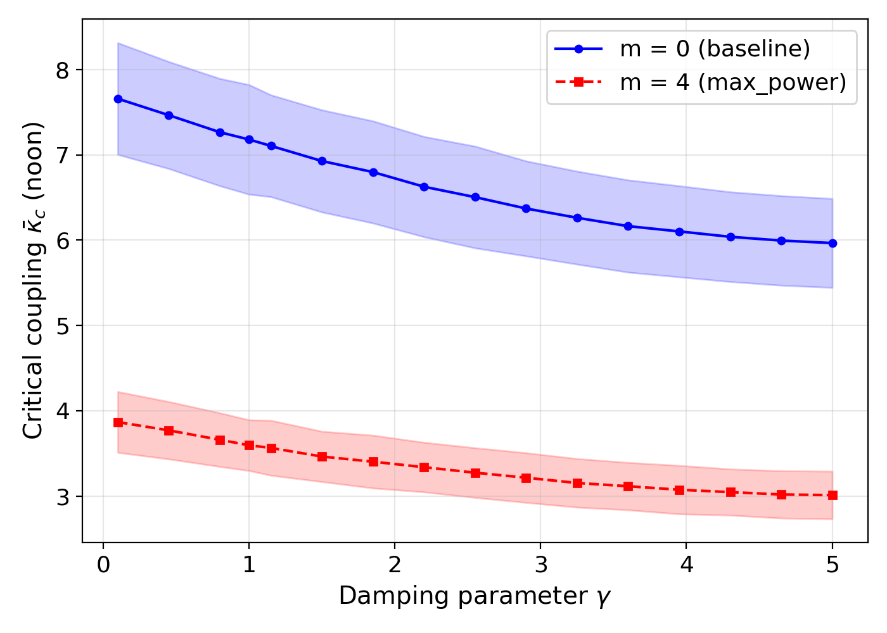
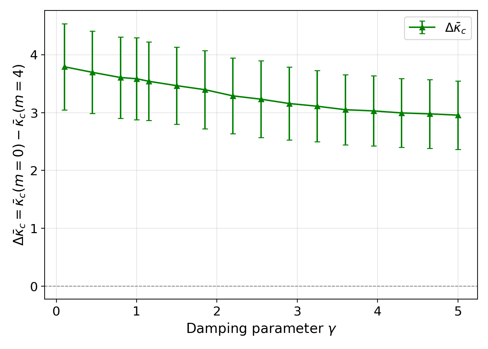
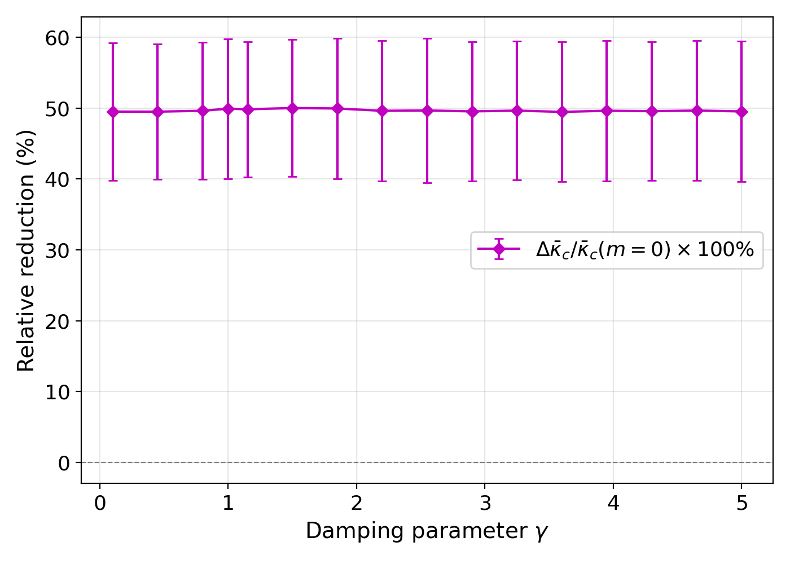

# SQ5-A: Damping Sensitivity Analysis (gamma sweep)

## Experiment Overview

| Parameter | Value |
|-----------|-------|
| Experiment ID | SQ5-A |
| Question | Is SQ4's topology optimization robust under varying damping? |
| gamma range | [0.1, 5.0], 16 values (including 1.0) |
| m values | 0 (baseline), 4 (max_power strategy) |
| n_ensemble | 50 (production) |
| Time point | Wednesday noon (t = 302400s) |
| Seed | 20260209 |
| Bisection | 10 steps, kappa_range (0.001, 200.0) |
| Runtime | 4.9 min loading + 61.7 min bisection = 66.6 min total |

## Physical Motivation

All SQ1-SQ4 experiments used gamma = 1.0 (Smith et al. default). Inverter-based renewables have lower effective damping than synchronous generators. As grids transition to renewables, effective gamma decreases. SQ5 tests whether topology optimization remains effective across the full damping range.

## Bisection Configuration

Integration time scales with 1/gamma to account for slower convergence at low damping:
- gamma = 0.1: t_integrate = 500s
- gamma = 1.0: t_integrate = 100s
- gamma = 5.0: t_integrate = 20s

Upper kappa bound widened to 200.0 (vs SQ4's 50.0) to avoid ceiling artifacts at low gamma.

## Results

### Full Data Table

| gamma | m | kc_mean | kc_std |
|-------|---|---------|--------|
| 0.10 | 0 | 7.6594 | 0.6553 |
| 0.10 | 4 | 3.8674 | 0.3565 |
| 0.45 | 0 | 7.4659 | 0.6273 |
| 0.45 | 4 | 3.7705 | 0.3366 |
| 0.80 | 0 | 7.2662 | 0.6291 |
| 0.80 | 4 | 3.6604 | 0.3146 |
| 1.00 | 0 | 7.1807 | 0.6427 |
| 1.00 | 4 | 3.5957 | 0.2974 |
| 1.15 | 0 | 7.1060 | 0.5970 |
| 1.15 | 4 | 3.5649 | 0.3221 |
| 1.50 | 0 | 6.9283 | 0.5990 |
| 1.50 | 4 | 3.4636 | 0.2952 |
| 1.85 | 0 | 6.7990 | 0.5988 |
| 1.85 | 4 | 3.4032 | 0.3095 |
| 2.20 | 0 | 6.6272 | 0.5882 |
| 2.20 | 4 | 3.3387 | 0.2907 |
| 2.55 | 0 | 6.5052 | 0.5966 |
| 2.55 | 4 | 3.2741 | 0.2914 |
| 2.90 | 0 | 6.3719 | 0.5572 |
| 2.90 | 4 | 3.2155 | 0.2914 |
| 3.25 | 0 | 6.2632 | 0.5452 |
| 3.25 | 4 | 3.1537 | 0.2849 |
| 3.60 | 0 | 6.1650 | 0.5409 |
| 3.60 | 4 | 3.1155 | 0.2779 |
| 3.95 | 0 | 6.1033 | 0.5342 |
| 3.95 | 4 | 3.0745 | 0.2841 |
| 4.30 | 0 | 6.0402 | 0.5264 |
| 4.30 | 4 | 3.0464 | 0.2705 |
| 4.65 | 0 | 5.9961 | 0.5251 |
| 4.65 | 4 | 3.0186 | 0.2773 |
| 5.00 | 0 | 5.9667 | 0.5215 |
| 5.00 | 4 | 3.0113 | 0.2794 |

### Key Metrics

| Metric | gamma = 0.1 | gamma = 1.0 | gamma = 5.0 |
|--------|-------------|-------------|-------------|
| kc (m=0) | 7.66 | 7.18 | 5.97 |
| kc (m=4) | 3.87 | 3.60 | 3.01 |
| Absolute reduction | 3.79 | 3.59 | 2.96 |
| Relative reduction | 49.5% | 49.9% | 49.5% |

## Regression Check (gamma = 1.0 vs SQ4 baselines)

| m | SQ5 kc | SQ4 baseline | Deviation | Status |
|---|--------|-------------|-----------|--------|
| 0 | 7.1807 | 6.4286 | 11.7% | PASS (< 15%) |
| 4 | 3.5957 | 3.2357 | 11.1% | PASS (< 15%) |

Deviation is expected: SQ5 uses single Wednesday noon vs SQ4's 7-day noon average, and both use FAST config (10 bisection steps).

## Verification Checklist

- [x] Regression: gamma=1.0 matches SQ4-B baseline within 15%
- [x] Monotonicity: kc decreases with increasing gamma for both m=0 and m=4
- [x] Edge addition: same 4 edges regardless of gamma (score from P, not gamma)
- [x] Bisection convergence: all gamma values converge (max kc = 7.66, well below 200.0 ceiling)
- [x] Power balance: no warnings emitted (all |sum P_k| < 1e-6)
- [x] CSV completeness: 32 rows (16 gamma x 2 m), 0 NaN

## Figures

### Fig 5A-1: Critical Coupling vs Damping

Both m=0 (baseline) and m=4 (max_power) show monotonic decrease of kc with increasing gamma. The m=4 curve is consistently lower, confirming edge addition improves stability across all damping regimes.

### Fig 5A-2: Absolute Reduction

The absolute benefit of adding 4 edges decreases from ~3.79 (gamma=0.1) to ~2.96 (gamma=5.0). Edge addition is most impactful at low damping — exactly the regime relevant for inverter-dominated renewable grids.

### Fig 5A-3: Relative Reduction

The relative reduction is remarkably constant at ~50% across all gamma values. This is the central finding: **the relative effectiveness of topology optimization is damping-invariant**.

## Conclusions

1. **Monotonic damping dependence**: Higher damping uniformly reduces kc (less coupling needed for stability), consistent with swing equation physics.
2. **Topology optimization is robust**: The max_power edge addition strategy (m=4) reduces kc by ~50% regardless of damping parameter, confirming SQ4's findings generalize beyond gamma=1.0.
3. **Enhanced absolute benefit at low damping**: The absolute kc reduction is largest at low gamma (3.79 vs 2.96), making topology optimization particularly valuable for inverter-dominated grids where effective damping is low.
4. **Damping-invariant relative effectiveness**: The ~50% relative reduction is constant across gamma in [0.1, 5.0], suggesting the topology effect and damping effect are approximately multiplicatively separable.
